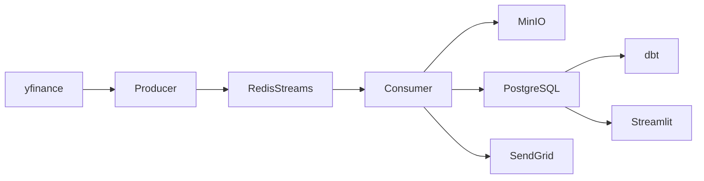

# Pulse Pipeline

**Real-time stock market data pipeline · flagship data-engineering lab**

[](.github/workflows/ci.yml)
[](https://www.python.org/)
[](docs/architecture.md)
[](docs/index.md)

Students build a **deployable** system: ingest OHLCV, stream it through Redis, land raw Parquet in MinIO, load PostgreSQL, compute indicators, chart them in Streamlit, and optionally email SMA/RSI alerts. Compose runs the services; dbt runs as an explicit build step.

<p align="center">
  <sub>Dashboard · MinIO console · 17-task course map · professional docs site</sub>
</p>

---

## Architecture



| Layer | Choice | Why it belongs in a job-ready lab |
| --- | --- | --- |
| Stream | Redis 7 Streams | Consumer groups without Kafka ops overhead |
| Lake | MinIO (S3 API) | Immutable Parquet, `ticker=/date=` partitions |
| Warehouse | PostgreSQL 15 | Upserts, indexes, dbt sources |
| App | Streamlit + Plotly | Interactive candlesticks students can demo |
| Ship | Compose + Actions | One-command runtime and a green CI gate |

## Quick start

```bash
git clone <this-repo> && cd real-time-stock-pipeline
cp .env.example .env
docker compose up --build
```

| Open | Where |
| --- | --- |
| Live dashboard | [http://localhost:8501](http://localhost:8501) |
| MinIO console | [http://localhost:9001](http://localhost:9001) · `minioadmin` |
| Course docs | `pip install -r requirements.txt && mkdocs serve` |

`DATA_SOURCE=auto` tries yfinance and replays `data/sample/ohlcv_sample.csv` during a cooldown when live retrieval fails. Set `DATA_SOURCE=sample` for deterministic demos and end-to-end tests.

## Repository tour

```
src/ingestion/     fetcher + Redis producer
src/processing/    consumer, Pydantic schema, cleaner, indicators, signals
src/storage/       MinIO Parquet + Postgres upserts
src/dashboard/     Streamlit lab UI
src/alerts/        SendGrid (off by default)
sql/               warehouse DDL
dbt_project/       daily_ohlcv & weekly_trends
tests/             pytest for indicators, schema, sample data
docs/              MkDocs Material site
```

## 17 course tasks

Module 1 · scaffold, env, API retries  
Module 2 · producer, consumer, MinIO, JSON logs  
Module 3 · clean, SMA/RSI/MACD/Bollinger, schema, dbt  
Module 4 · dashboard, crossover flags, email  
Module 5 · Compose, CI, this README  

See [docs/tasks.md](docs/tasks.md) for file-level mapping.

## Tests

```bash
python3 -m venv .venv && source .venv/bin/activate
pip install -r requirements.txt
pytest --cov=src --cov-fail-under=70
```

## Tradeoffs

Redis over Kafka keeps laptops happy and still teaches ACK/consumer groups. yfinance is free but flaky, so retries plus a sample dataset are part of the design. Streamlit ships a demo in hours; a Next.js campus platform is a later product phase, not a blocker for the lab.

## Known limitations

This is a teaching pipeline, not a colocation feed. Duplicate timestamps are suppressed, sample bars replay once in order, and indicators remain in warmup until enough distinct history exists.

## End-to-end verification

With the stack running and at least 50 bars per ticker loaded:

```bash
make e2e
```

Run dbt independently with `make dbt` whenever the warehouse models should be refreshed.

## Bring your own dataset

The finished project accepts timestamp-sorted CSV and Parquet files with:

```text
timestamp,ticker,open,high,low,close,volume
```

Start the stack, validate the file, and stream it through the same Redis → MinIO/PostgreSQL path as live data:

```bash
make validate-data FILE=/absolute/path/to/ohlcv.csv
make import-data FILE=/absolute/path/to/ohlcv.csv
```

The import command waits for the consumer to finish. See [Local datasets](docs/local-datasets.md) for formatting and large-file guidance.

## License

MIT — see [LICENSE](LICENSE). Third-party attribution: [COURSE_LICENSES.md](COURSE_LICENSES.md).
