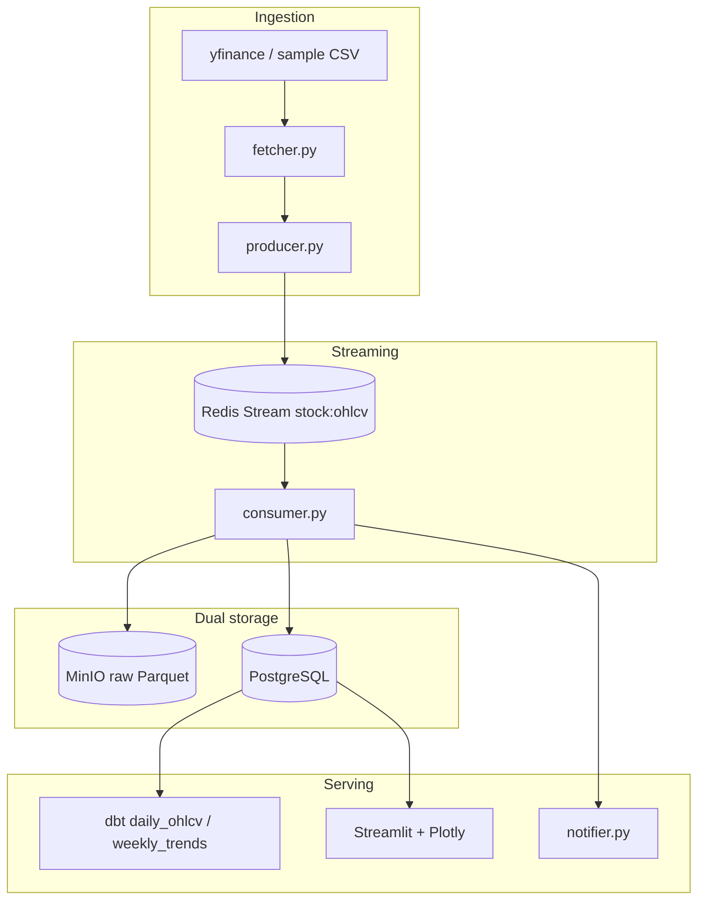

# Architecture

## Runtime topology



## Why dual storage

| Store | Role | Student takeaway |
| --- | --- | --- |
| MinIO (S3 API) | Immutable raw lake, Parquet, partitioned by ticker and date | Replay, audit, cheap object storage |
| PostgreSQL | Cleaned, indexed, dashboard-friendly | Constraints, upserts, SQL analytics |
| Redis Streams | Buffer between fetch and persistence | Backpressure, consumer groups, ACKs |

## Message contract

Each Redis message carries a JSON `payload`:

```json
{
  "timestamp": "2026-01-05T14:30:00+00:00",
  "ticker": "AAPL",
  "open": 185.1,
  "high": 185.6,
  "low": 184.8,
  "close": 185.4,
  "volume": 1200000,
  "ingested_at": "2026-01-05T14:30:02+00:00"
}
```

`OHLCVBar` in `src/processing/schema.py` rejects impossible high/low combinations before anything is written.

## Processing path

1. Consumer reads the stream with `XREADGROUP` and reclaims abandoned entries with `XAUTOCLAIM`.
2. Pydantic validates the payload.
3. Raw bar is written to MinIO and upserted into `raw_ohlcv`.
4. Cleaner sorts, deduplicates, and forward-fills numeric gaps.
5. Indicators and SMA crossover flags are upserted into `processed_indicators`.
6. Optional SendGrid alerts fire on crossover or RSI extremes.
7. Repeated transient failures move to a dead-letter stream after the configured attempt limit.

## Latency budget (lab)

The course target is **sub-500ms inside the pipeline** after a bar is fetched (Redis publish → consume → validate). Network time to yfinance is outside that budget and is why we retry with Tenacity.
