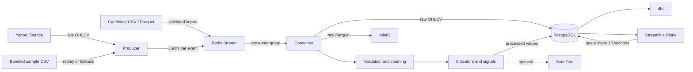
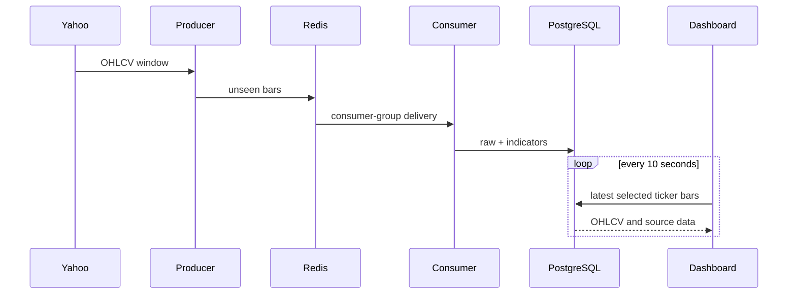

# Pulse Pipeline — Complete Architecture and Integration Flow

| Field | Value |
| --- | --- |
| Product | Pulse Pipeline |
| Platform | WorkForge Data Engineering Project |
| Purpose | Ingest, process, store and visualize OHLCV stock data |
| Runtime | Python 3.11 and Docker Compose |
| Main UI | Streamlit on port `8501` |
| Status | Candidate-ready |

## Executive summary

Pulse Pipeline is an event-driven data application. It accepts stock bars from live, sample or candidate-owned sources, sends them through Redis, validates and processes every event, stores results in PostgreSQL and MinIO, and displays automatically refreshing technical analysis.

The project has **15 integrated building blocks**:

| # | Integration | Responsibility | Runtime requirement |
| --- | --- | --- | --- |
| 1 | Yahoo Finance / `yfinance` | Optional live OHLCV source | Optional |
| 2 | Bundled sample CSV | Offline WorkForge source and live fallback | Mode-dependent |
| 3 | CSV/Parquet importer | Candidate dataset input | Optional |
| 4 | Producer | Fetches or replays bars and creates events | Required |
| 5 | Redis Streams | Event transport and consumer-group delivery | Required |
| 6 | Consumer | Coordinates processing and storage | Required |
| 7 | Pydantic and cleaning | Validates and normalizes market bars | Required |
| 8 | Indicator engine | SMA, RSI, MACD, Bollinger and crossovers | Required |
| 9 | PostgreSQL | Queryable raw and processed records | Required |
| 10 | MinIO | S3-compatible Parquet object storage | Required |
| 11 | Streamlit and Plotly | Dashboard, charts and trend analysis | Required |
| 12 | dbt | Daily and weekly analytical models | On demand |
| 13 | SendGrid | Optional email alerts | Disabled by default |
| 14 | Docker Compose | Services, networking, health and volumes | Required |
| 15 | GitHub Actions and MkDocs | CI and documentation | Development |

## System architecture



## Data-source flow

`DATA_SOURCE` selects how the producer behaves:

| Mode | Behaviour | Best use |
| --- | --- | --- |
| `sample` | Replays bundled data without internet | WorkForge candidate workspace |
| `auto` | Tries Yahoo, then enters a sample-data cooldown if unavailable | Local demo |
| `live` | Requires Yahoo and surfaces retrieval failures | Final live integration |

The default ticker list is `AAPL,MSFT,GOOGL`. Live mode requests five-minute OHLCV candles. On startup it publishes the available lookback window so rolling indicators have history; later requests publish only unseen timestamps.

Every source becomes the same normalized event:

```json
{
  "timestamp": "2026-08-28T19:55:00+00:00",
  "ticker": "AAPL",
  "open": 100.0,
  "high": 102.0,
  "low": 99.0,
  "close": 101.0,
  "volume": 1250000,
  "ingested_at": "2026-08-28T20:00:00+00:00",
  "source": "live"
}
```

`source` is `live`, `sample`, `local` or `unknown` and remains attached through storage and display.

## Producer → Redis connection

The producer publishes JSON events to Redis Stream `stock:ohlcv`. Redis separates ingestion from processing, allowing the producer and consumer to run independently.

- Consumer group: `pipeline`
- Default consumer: `worker-1`
- Successful events: acknowledged
- Temporary failures: left pending and reclaimed after the idle timeout
- Repeated failures: moved to `stock:ohlcv:dead-letter`
- Stream length: bounded approximately by the configured maximum

This provides retry and recovery without creating duplicate database rows.

## Consumer processing flow

For every Redis event, the consumer performs these operations in order:

1. Parse JSON.
2. Validate with the `OHLCVBar` Pydantic schema.
3. Normalize timestamps and missing ingestion metadata.
4. Write an immutable Parquet object to MinIO.
5. Upsert the raw row into PostgreSQL.
6. Load up to 100 bars for the same ticker ending at this timestamp.
7. Clean and select the latest contiguous history segment.
8. Calculate indicators and signals.
9. Upsert processed values into PostgreSQL.
10. Evaluate optional alerts.
11. Acknowledge the Redis event.

Validation checks required values, allowed source labels, positive prices, non-negative volume, and valid high/low relationships. Invalid messages are logged and skipped so they cannot block the stream.

## Indicator integration

| Calculation | Meaning in the application |
| --- | --- |
| SMA 20 | Shorter-term average price trend |
| SMA 50 | Broader price trend |
| RSI 14 | Momentum and overbought/oversold context |
| MACD | Difference between fast and slow exponential averages |
| MACD signal and histogram | MACD direction and distance from signal |
| Bollinger Bands | Volatility range around SMA 20 |
| SMA crossover | Bullish or bearish crossing event |
| Support/resistance | Lowest low and highest high in the recent 20 bars |

Long gaps between sample, local and live dates reset rolling history to the newest contiguous segment. This prevents unrelated periods from contaminating trend calculations.

## Dual-storage connection

Every valid bar is stored twice for different purposes:

### PostgreSQL

- `raw_ohlcv` contains normalized source bars.
- `processed_indicators` contains calculated values.
- `(ticker, timestamp)` is the idempotent grain.
- The dashboard and dbt query PostgreSQL.

### MinIO

- Stores immutable Parquet objects using an S3-compatible API.
- Preserves file-based raw history separately from the query database.
- The default bucket is `raw-ohlcv`.
- API: port `9000`; administrator console: port `9001`.
- Project credentials are `MINIO_ACCESS_KEY` and `MINIO_SECRET_KEY`.

This is a common lake-plus-warehouse pattern: durable objects for raw history and relational tables for fast queries.

## Dashboard connection and refresh flow

The dashboard never contacts Yahoo directly. It reads PostgreSQL.



Dashboard capabilities:

- ticker and history-length selection;
- candlestick or closing-price line display;
- selectable SMA 20, SMA 50, Bollinger, support and resistance lines;
- volume, RSI and SMA crossover metrics;
- bullish, bearish, mixed or warming-up trend classification;
- momentum and key-level summary;
- source identification and infrastructure health.

The browser checks PostgreSQL every 10 seconds. This does not create new prices. With five-minute candles, visible market changes usually occur every five minutes while the US market is open. On weekends and outside market hours, the latest stored candle remains unchanged.

## Candidate CSV/Parquet flow

Required dataset columns:

```text
timestamp,ticker,open,high,low,close,volume
```

Commands:

```bash
make validate-data FILE=/absolute/path/to/ohlcv.csv
make import-data FILE=/absolute/path/to/ohlcv.csv
```

The importer reads large files in chunks, accepts case-insensitive columns, validates all rows before publishing, checks timestamp ordering per ticker, labels data `local`, publishes Redis batches and waits for zero consumer lag and zero pending messages. Candidate data therefore uses the same processing, MinIO, PostgreSQL and dashboard flow as live data.

## dbt analytical flow

dbt reads PostgreSQL and builds:

| Model | Result |
| --- | --- |
| `daily_ohlcv` | Daily OHLCV summaries per ticker |
| `weekly_trends` | Weekly trend-level aggregates |

Schema and singular tests check quality and unique grains. dbt runs explicitly:

```bash
make dbt
```

## Optional alert flow

SMA crossovers and RSI threshold events can call SendGrid. Delivery occurs only when email alerts are enabled and a key is injected. With alerts disabled, the same events are logged locally and no external request is made.

## Network connections and ports

| Service | Container address | Host address | Clients |
| --- | --- | --- | --- |
| Redis | `redis:6379` | `127.0.0.1:6379` | Producer, consumer, importer |
| PostgreSQL | `postgres:5432` | `127.0.0.1:5432` | Consumer, dashboard, dbt |
| MinIO API | `minio:9000` | `127.0.0.1:9000` | Consumer and MinIO client |
| MinIO console | `minio:9001` | `http://localhost:9001` | Administrator |
| Dashboard | `dashboard:8501` | `http://localhost:8501` | Candidate browser |

Containers use Docker DNS names, not `localhost`, to reach one another. Host ports bind only to `127.0.0.1` by default.

## Docker startup flow

1. Redis, PostgreSQL and MinIO start and run health checks.
2. `minio-init` waits for MinIO, then creates the bucket.
3. Consumer waits for Redis, PostgreSQL, MinIO and bucket initialization.
4. Producer waits for Redis.
5. Dashboard waits for PostgreSQL.

Pinned image digests make builds repeatable. Named volumes preserve PostgreSQL and MinIO content between ordinary restarts.

## Failure and recovery behaviour

| Failure | Behaviour |
| --- | --- |
| Yahoo unavailable in `auto` | Cooldown plus sample fallback |
| Yahoo unavailable in `live` | Fetch error is logged and surfaced |
| Duplicate timestamp | PostgreSQL upsert prevents duplicate rows |
| Invalid event | Logged, acknowledged and skipped |
| Temporary consumer error | Pending message is retried |
| Repeated consumer error | Event enters dead-letter stream |
| Consumer restart | Abandoned pending events are reclaimed |
| Dashboard database error | Health status/fallback is displayed |
| Long market-data gap | Indicator history resets at the gap |
| Closed market | Latest data remains visible |

## WorkForge operating model

Use deterministic mode for candidate workspaces:

```env
DATA_SOURCE=sample
```

Expose `8501` as the main application preview. Port `9001` can be an optional infrastructure view. Redis, PostgreSQL and MinIO port `9000` should normally remain internal.

At completion, candidates can import their own dataset or activate `auto`/`live`. Yahoo through `yfinance` is appropriate for education but is not a guaranteed production market-data service.

## End-to-end verification

```bash
cp .env.example .env
docker compose up -d --build
make e2e
.venv/bin/python -m flake8 src tests
.venv/bin/python -m pytest tests -q
make dbt
docker compose config --quiet
```

Useful checks:

```bash
docker compose ps -a
docker compose logs --tail=50 producer consumer dashboard
```

- Dashboard: `http://localhost:8501`
- Dashboard health: `http://localhost:8501/_stcore/health`
- MinIO console: `http://localhost:9001`

## Security boundaries

- Commit `.env.example`, never `.env`.
- Never store API keys, passwords or candidate datasets in Git.
- Replace local default credentials outside isolated development.
- Keep SendGrid disabled until the runtime injects a secret.
- Restrict administrative ports to the workspace network.
- Treat imported datasets as candidate-owned content.
- Trend output describes historical behaviour; it is not financial advice.

## Definition of done

The system is working end to end when:

1. all required containers are healthy;
2. the producer or importer publishes events;
3. Redis has zero lag and pending events after processing;
4. MinIO contains Parquet objects;
5. PostgreSQL contains raw and indicator rows;
6. SMA and RSI values populate after warmup;
7. the dashboard shows multiple candles and refreshes automatically;
8. chart analysis overlays can be switched on and off;
9. dbt models and tests pass;
10. lint, unit tests and `make e2e` pass.
