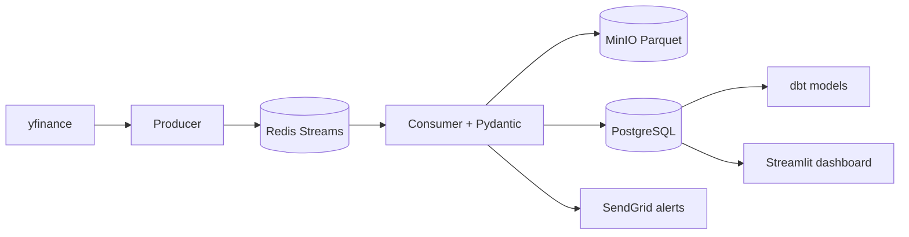

# Pulse Pipeline

A production-shaped **real-time stock market data pipeline** built as the lab for a flagship data-engineering course.

Students do not watch a toy notebook. They ship the same patterns hiring managers look for: streaming ingestion, dual storage, validation, indicators, dashboards, alerts, Docker, and CI.

<div class="grid cards" markdown>

- **Latency-minded streaming** — yfinance → Python producer → Redis Streams → consumer
- **Dual storage** — immutable Parquet in MinIO, queryable rows in PostgreSQL
- **Job-ready polish** — retries, JSON logs, dbt models, Streamlit + Plotly, GitHub Actions

</div>

## What you will build



## Learning outcomes

After this lab you can:

- Ingest OHLCV with retry/backoff and publish it onto Redis Streams
- Validate messages with Pydantic and keep a raw lake + a cleaned warehouse
- Compute SMA, RSI, MACD, and Bollinger Bands in Python
- Detect SMA crossovers and fire optional email alerts
- Run the stack with `docker compose up` and prove it with pytest + CI

## 60-second start

```bash
cp .env.example .env
docker compose up --build
```

Then open:

| Surface | URL |
| --- | --- |
| Live dashboard | http://localhost:8501 |
| MinIO console | http://localhost:9001 (`minioadmin` / `minioadmin`) |
| Docs site | `mkdocs serve` → http://127.0.0.1:8000 |

Sample CSV under `data/sample/` keeps the dashboard useful if a live API call is rate-limited.

## Course modules (17 tasks)

| Module | Tasks | Theme |
| --- | --- | --- |
| 1 | 1–3 | Scaffolding, env, API fetcher |
| 2 | 4–7 | Redis producer/consumer, MinIO, logging |
| 3 | 8–11 | Cleaning, indicators, Postgres, dbt |
| 4 | 12–14 | Streamlit, crossovers, SendGrid |
| 5 | 15–17 | Docker Compose, CI, professional README |

Full mapping lives in [17 Tasks](tasks.md).

## Tradeoffs

- **Redis Streams instead of Kafka** — simpler locally, still teaches consumer groups, acknowledgements, and replay. Kafka is a natural advanced-course upgrade.
- **yfinance instead of a paid feed** — free for education; we wrap it in retries and a sample-data fallback because it is not an SLA-backed vendor API.
- **MinIO instead of AWS S3** — S3-compatible, zero cloud bill, same partitioning story (`ticker=/date=`).
- **Streamlit instead of a custom React UI** — Python-native, fast to ship; the commercial course platform can still be Next.js.

## Known limitations

- Polling 5-minute bars every few seconds is a **teaching loop**, not exchange-grade tick data.
- Indicator calculations on a single incoming bar will be incomplete until enough history sits in Postgres; the dashboard recomputes on the loaded window.
- Email alerts stay off until `ENABLE_EMAIL_ALERTS=true` and a SendGrid key is set.

## License note

Original pipeline code in this repository is MIT licensed — see `LICENSE`. Third-party libraries keep their own licenses — see `COURSE_LICENSES.md`.
